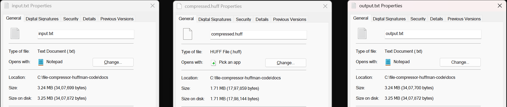

# File Compressor

A C++ implementation of file compression and decompression using static Huffman coding.

## Structure
- **include/**: Headers for Huffman, bit I/O
- **src/**: Implementation files and CLI
- **tests/**: Unit test for round-trip compression
- **CMakeLists.txt**: Build script

## Quick Start
1. Clone the repo:

```bash
git clone https://github.com/abhaysingh05/file-zipper-huffman-coding.git
cd file-zipper-huffman-coding
```
2. Build

```bash
mkdir build && cd build
cmake .. -G "MinGW Makefiles" -DCMAKE_C_COMPILER=gcc -DCMAKE_CXX_COMPILER=g++
mingw32-make
```
3. Compress:
```bash
./zipper -c ../docs/input.txt ../docs/compressed.huff
```
4. Decompress:
```bash
./zipper -d ../docs/compressed.huff ../docs/output.txt
```
5. Test:
```bash
ctest
```
## Compression Results

The following image demonstrates the effectiveness and accuracy of the Huffman-based compressor:



- **Original size:** 3.24 MB (`input.txt`)
- **Compressed size:** 1.71 MB (`compressed.huff`)
- **Decompressed output:** 3.24 MB (`output.txt`) — bit-exact to input

The tool achieves a **47% size reduction** with full round-trip fidelity.

# License

MIT License (see [LICENSE](LICENSE))
